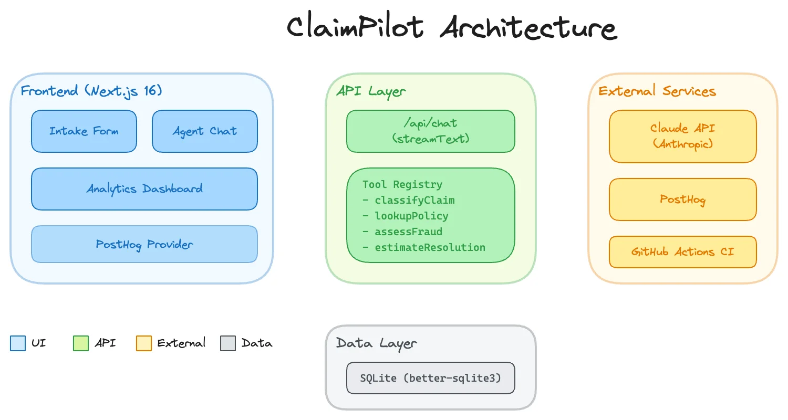

# ClaimPilot

AI-powered insurance claims triage that classifies, verifies coverage, screens for fraud, and recommends resolution paths in under 60 seconds.

## The Problem

When a customer files a First Notice of Loss, the claim has to be classified, the policy verified, fraud indicators checked, and the claim routed to the right adjuster. That process typically takes 24 to 48 hours, and misrouted claims add 5 to 10 more days on top of that.

Large P&C carriers process millions of claims a year, and loss adjustment expense runs 10 to 12% of incurred losses. Even small improvements at the triage stage save real money.

## The Approach

ClaimPilot is a multi-step agent, not a chatbot. I used Claude's tool-use API to build a system where the agent has four specialized tools and decides on its own which to call and in what order:

1. **classifyClaim** - Extracts claim type, severity, coverage area, and key details from free-text descriptions
2. **lookupPolicy** - Verifies coverage status, deductible, limits, and covered perils
3. **assessFraud** - Screens for red flags: new policy timing, coverage limit proximity, no witnesses, inconsistent details
4. **estimateResolution** - Recommends a path (approve, investigate, escalate, deny) with estimated payout range and next steps

The agent streams its reasoning and tool calls to the UI in real-time. You can watch it think through the claim step by step.

## Architecture



The intake form sends the claim to a Claude agent via Vercel AI SDK's `streamText`. The agent calls its tools, streams the results back to the UI as collapsible cards, stores everything in SQLite, and fires PostHog events. The dashboard is a server component that queries SQLite directly.

**Stack:** Next.js 16, TypeScript, Tailwind 4, shadcn/ui, Vercel AI SDK, Claude API, SQLite, PostHog, Vitest

## Demo Data & Results

I ran 16 sample claims (auto, home, liability) through the system. Here's what came back:

| Metric | Result |
|---|---|
| Average triage time | Under 1 second (vs. 24-48 hours manual) |
| Fraud flag rate | 13% (medium + high risk) |
| Auto-resolution rate | 6% (low-complexity STP candidates) |
| Resolution distribution | 1 approve, 9 investigate, 5 escalate, 1 deny |
| Severity distribution | 3 medium, 9 high, 4 critical |

The sample claims include edge cases: fraud indicators (new policy + total loss claim at a cousin's shop), expired policies (automatic deny), ambiguous coverage (foundation damage), and multi-party incidents.

## Non-Goals (v1)

- No real PII or customer data handling
- No authentication or role-based access
- No integration with real claims management systems (Guidewire, Duck Creek)
- No automated claim settlement (triage and recommendation only)
- No multi-turn conversation (single claim submission per triage)

## Key Technical Decisions

- **Streaming tool-use over prompt chaining.** The agent decides tool order autonomously. If the policy is expired, it skips fraud assessment and goes straight to denial. That's closer to how a real adjuster thinks.
- **Rule-based tools, LLM orchestration.** Tools are deterministic and testable (18 unit tests). Claude decides which to call and interprets results. The demo works without burning API credits for every data point.
- **SQLite for demo, designed for production.** The dashboard queries SQLite directly as a server component. In production, swap for Turso or PostgreSQL without changing the query layer.
- **"Triage assistance" not "automation."** No carrier will let AI auto-settle claims. I validated this with insurance industry expertise early on. ClaimPilot gives adjusters a head start, it doesn't replace them.

Full [decision log](docs/decision-log.md) with 8 tradeoff entries.

## What I'd Do Next

If this were a real product inside a carrier:

- **Real data integration** - Connect `lookupPolicy` to a policy admin system (e.g. Guidewire, Duck Creek) instead of sample data
- **ML-based tools** - Replace rule-based classification with models trained on historical claims
- **Document upload** - Photo/video damage assessment
- **Authentication** - Role-based access for adjusters, supervisors, and SIU
- **Feedback loop** - Adjuster corrections improve model accuracy over time
- **A/B testing** - Test different resolution thresholds and escalation criteria
- **Regulatory compliance** - State-specific time-to-contact rules, unfair claims settlement practices

## Built With

[Next.js 16](https://nextjs.org) | [TypeScript](https://www.typescriptlang.org) | [Tailwind CSS 4](https://tailwindcss.com) | [shadcn/ui](https://ui.shadcn.com) | [Vercel AI SDK](https://sdk.vercel.ai) | [Claude API](https://docs.anthropic.com) | [SQLite](https://www.sqlite.org) | [PostHog](https://posthog.com) | [Vitest](https://vitest.dev)

## Running Locally

```bash
pnpm install
cp .env.example .env.local  # Add your ANTHROPIC_API_KEY
pnpm seed                   # Populate sample data
pnpm dev                    # Start dev server
```

## About

Built by [Marcelo Otero](https://www.linkedin.com/in/marcelo-otero/). I'm a product manager who builds. I made ClaimPilot to show how agentic AI can be applied to a real product problem end to end, and to demonstrate that I can take a product from idea through shipped, instrumented prototype.
